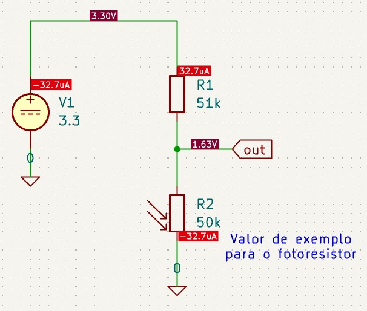

# Project2_LabEmbarcados

O projeto tem como objetivo desenvolver um sistema embarcado utilizando a placa BitDogLab que se comunica com um celular via Bluetooth. Através de um aplicativo terminal Bluetooth, o usuário poderá solicitar leituras de um sensor de temperatura e umidade, além de enviar comandos para o acionamento de um servo motor. Além disso, um fotoresistor medirá a luminosidade e, a partir disso, o microcontrolador irá acender ou apagar o LED RGB da placa.

## Especificação do Projeto

O projeto tem como finalidade integrar sensores e atuadores com uma interface de controle remota via Bluetooth. O usuário será capaz de:

- Consultar a temperatura e umidade ambiente
- Acionar ou alterar a posição de um servo motor
- Visualizar as respostas do sistema diretamente pelo terminal Bluetooth no celular
- Visualizar o LED RGB sendo controlado pelo fotoresistor 

## Funcionamento

- O sistema utiliza o módulo HC-06 para realizar a comunicação bluetooth, permitindo o envio e recebimento de dados através de uma interface serial (através do protocolo UART).
- O servo motor muda de posição de acordo com o comando enviado pelo usuário, se movendo de maneira suave. O servo motor é controlado por um sinal PWM vindo do Raspberry Pi Pico, e é alimentado através de uma fonte externa de 5V.
- Para a leitura da temperatura e umidade, o sistema se comunica com o sensor DHT11 através de um protocolo one-wire.
- Para controle e correto funcionamento do fotoresistor, montamos um circuito divisor de tensão, como mostrado na figura abaixo. Uma resistência de $51k\Omega$ foi utilizada em conjunto com o fotoresistor para o fator de calibração desejado.

Um vídeo de demonstração do projeto foi publicado no [youtube](https://youtu.be/KHZL84H6xg0)
